<div align="center">



<a href="https://github.com/nicollascamargo">
  
</a>

<br><br>

<a href="https://www.linkedin.com/in/nicollas-abreu-svidevska-de-camargo-0b148a351/"></a>
<a href="mailto:nicollascamargo81@gmail.com"></a>
<a href="https://nicollascamargo.github.io"></a>

</div>

<br>

## `$ whoami`

```yaml
name:       Nicollas Camargo
role:       Data Science · Data Engineering · Machine Learning
location:   Sorocaba, SP, Brazil
studying:   Systems Analysis and Development (graduating Dec 2026)
languages:  [Portuguese (native), English (C1)]
open_to:    junior roles and internships in data and AI, remote or international
```

I build **ETL pipelines, forecasting models, APIs and backend systems**, from the first draft to something that runs and is tested.

## `$ ls capabilities/`

<table>
<tr>
<td width="50%" valign="top">

**`data_pipelines/`**
ETL workflows that collect, clean and load data, with automated tests so the numbers can be trusted.

</td>
<td width="50%" valign="top">

**`forecasting_ml/`**
Predictive models validated the right way (walk-forward for time series) and served through an API.

</td>
</tr>
<tr>
<td width="50%" valign="top">

**`backend_apis/`**
FastAPI and ASP.NET Core services with authentication, relational databases and documentation.

</td>
<td width="50%" valign="top">

**`analytics/`**
SQL and Power BI to turn data into dashboards people actually use to decide.

</td>
</tr>
</table>

## `$ git log --projects`

<table>
<tr>
<td width="50%" valign="top">

`[DATA / ML]` · `status: shipped`

### [Poultry Price Forecasting](https://github.com/nicollascamargo/previsao-precos-avicultura)

Chicken price forecasting model in Python, served through a FastAPI API and validated with walk-forward validation.

`Python` · `FastAPI` · `scikit-learn`

</td>
<td width="50%" valign="top">

`[DATA ENGINEERING]` · `status: shipped`

### [Agro Sales Pipeline](https://github.com/nicollascamargo/pipeline-vendas-agro)

ETL pipeline in Python processing agribusiness sales data, with automated dashboard tests.

`Python` · `Pandas` · `ETL`

</td>
</tr>
<tr>
<td width="50%" valign="top">

`[ACADEMIC · PIM III]` · `status: delivered`

### Click Manager

Web management system for a photography studio: JWT authentication, accessibility documentation (LIBRAS) and a chapter applying Machine Learning to the system.

`ASP.NET Core 8` · `Entity Framework Core` · `SQL Server`

</td>
<td width="50%" valign="top">

`[DATA / ML]` · `status: in progress`

### House Price Prediction

Regression project with Python: feature engineering, model comparison and evaluation.

`Python` · `scikit-learn`

</td>
</tr>
</table>

## `$ ./workflow.sh`

```bash
1. scout   # define the question the data needs to answer
2. map     # clean, profile and validate the data before modeling
3. build   # model or pipeline, with tests and honest validation
4. launch  # deploy, document and make it easy to run
```

## `$ cat stack.txt`

<div align="center">
  
  
  
  
  
  
  
  
  
  
  
  
</div>

## `$ ./now`

```text
> studying statistics for data science, machine learning and data engineering
> building the next portfolio project: house price prediction
> looking for junior roles and internships in data and AI
```

<br>

<div align="center">

**`$ ./contact --open`**

<a href="mailto:nicollascamargo81@gmail.com"></a>


</div>
