  

Data Science · Data Engineering · Machine Learning student in Sorocaba, SP, Brazil.

 

 

## 🛰️ Ship Systems

<table>
<tr>
<td width="50%" valign="top">

### 🔄 Data pipelines
ETL workflows that collect, clean and load data, with automated tests so the numbers can be trusted.

</td>
<td width="50%" valign="top">

### 📈 Forecasting & ML
Predictive models validated the right way (walk-forward for time series) and served through an API.

</td>
</tr>
<tr>
<td width="50%" valign="top">

### ⚙️ Backend & APIs
FastAPI and ASP.NET Core services with authentication, relational databases and documentation.

</td>
<td width="50%" valign="top">

### 📊 Analytics
SQL and Power BI to turn data into dashboards people actually use to decide.

</td>
</tr>
</table>

## 🚀 Missions

<table>
<tr>
<td width="50%" valign="top">

🟢 **MISSION COMPLETE · DATA / ML**

### [Poultry Price Forecasting](https://github.com/nicollascamargo/previsao-precos-avicultura)

Chicken price forecasting model in Python, served through a FastAPI API and validated with walk-forward validation.

`Python` · `FastAPI` · `scikit-learn`

</td>
<td width="50%" valign="top">

🟢 **MISSION COMPLETE · DATA ENGINEERING**

### [Agro Sales Pipeline](https://github.com/nicollascamargo/pipeline-vendas-agro)

ETL pipeline in Python processing agribusiness sales data, with automated dashboard tests.

`Python` · `Pandas` · `ETL`

</td>
</tr>
<tr>
<td width="50%" valign="top">

🔵 **ACADEMY TRAINING · PIM III**

### Click Manager

Web management system for a photography studio: JWT authentication, accessibility documentation (LIBRAS) and a chapter applying Machine Learning to the system.

`ASP.NET Core 8` · `Entity Framework Core` · `SQL Server`

</td>
<td width="50%" valign="top">

🟠 **NEXT DESTINATION**

### House Price Prediction

Regression project with Python: feature engineering, model comparison and evaluation.

`Python` · `scikit-learn`

</td>
</tr>
</table>

## 🧭 Flight Plan

<table>
<tr>
<th>1. Scout</th>
<th>2. Map</th>
<th>3. Build</th>
<th>4. Launch</th>
</tr>
<tr>
<td>Define the question the data needs to answer.</td>
<td>Clean, profile and validate the data before modeling.</td>
<td>Model or pipeline with tests and honest validation.</td>
<td>Deploy, document and make it easy to run.</td>
</tr>
</table>

## 🪐 Orbit Map

  

## 🧰 Module Bay

<table align="center">
<tr>
<th>Languages</th>
<th>Data & ML</th>
<th>Backend</th>
<th>Databases & BI</th>
<th>Tools</th>
</tr>
<tr>
<td align="center">
  
  
  
   Python · R · C#
</td>
<td align="center">
  
  
  
   pandas · NumPy · scikit-learn
</td>
<td align="center">
  
  
   FastAPI · ASP.NET Core
</td>
<td align="center">
  
  
  
   MySQL · SQL Server · Power BI
</td>
<td align="center">
  
   Git · GitHub
</td>
</tr>
</table>

## 🌌 Trajectory

| Phase | Status |
|---|---|
| 📡 **Now** | Studying statistics for data science, machine learning and data engineering |
| 🚀 **Next** | House price prediction project (regression with Python) |
| 🎓 **Dec 2026** | Graduating in Systems Analysis and Development |
| 🌍 **Long-term** | Data career and further studies internationally |

Languages: Portuguese (native), English (C1). Open to junior roles and internships in data and AI, remote or international.

 

**Have a data problem in mind? Open a channel.**

